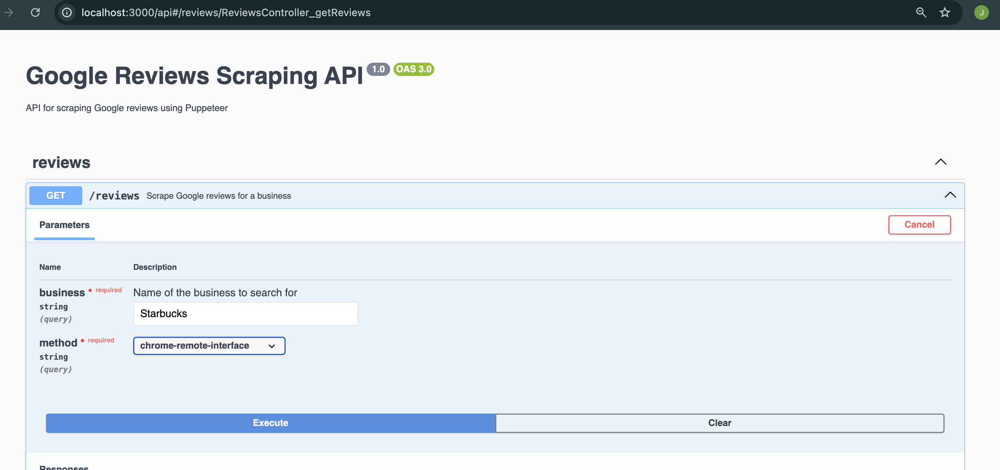

# README

## Steps to Setup and Run the Project

1. **Clone the Git Repository**

```bash
git clone https://github.com/jessy521/assessment.git
cd assessment
```

2. **Kill the Chrome Process**

- Manually: Open Task Manager (Windows) or Activity Monitor (Mac) and end the Chrome process.
- Command Line:

  ```bash
  # For Windows
  taskkill /F /IM chrome.exe

  # For Mac
  pkill -f "Google Chrome"
  ```

3. **Run Google Chrome in Debug Mode**

```bash
# For Windows
"C:\Program Files (x86)\Google\Chrome\Application\chrome.exe" --remote-debugging-port=9222

# For Mac
/Applications/Google\ Chrome.app/Contents/MacOS/Google\ Chrome --remote-debugging-port=9222
```

### Setting Up Debugger Mode

For more information on how to make Chrome always launch with the `--remote-debugging-port` flag, you can refer to this [Stack Overflow post](https://stackoverflow.com/questions/51563287/how-to-make-chrome-always-launch-with-remote-debugging-port-flag).

4. **Install Dependencies**

```bash
npm install
```

5. **Start the Development Server**

```bash
npm run start:dev
```

6. **Access the API**
   Open your browser and go to [http://localhost:3000/api](http://localhost:3000/api) to run the API.  
   and click on **'try it out'**


